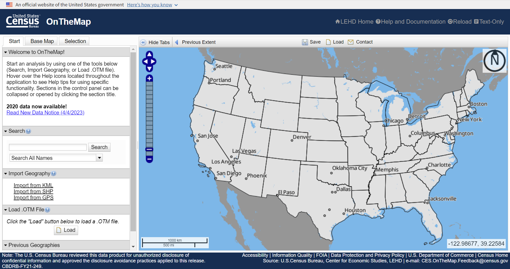

## Introduction


`lehdr` is a very simple yet useful R package to city planners and urban spatial analysts^[GitHub repoitory of lehdr: https://github.com/jamgreen/lehdr]. Jamaal Green [cre, aut], Liming Wang [aut], Dillon Mahmoudi [aut], Matthew Rogers [ctb], and Kyle Walker [ctb] developed the package to grab [Longitudinal Employer-Household Dynamics (LEHD)](https://lehd.ces.census.gov/) Origin-Destination Employment Statistics (LODES) flat files and return as dataframes in R. The package is still under development, yet some fundamental functions can be used to ease our struggles when downloading and importing LODES dara. In this tutorial, we will explore some functions and their common usage in daily urban data analysis.

**Why LODES data?** The LODES dataset is a valuable resource frequently utilized by various professionals, including transportation and economic development planners, regional economists, disaster managers, etc. It provides detailed information on employment distribution. One important application of this data is for creating regional travel demand models and shaping transportation policies. Additionally, regional economists and economic development planners use this data to assess different workforce policy options and industrial distribution. Moreover, when combined with census data, LODES facilitates the visualization of interactions between various population groups and employment patterns. Therefore, LODES is the primary source of comprehensive geographic employment data in the U.S.


**Why the `lehdr` package?** Before the development of this package, to use LODES data in R, we needed to download data (usually in *csv.gz* files) from the U.S. Census [OnTheMap](https://onthemap.ces.census.gov/) web application or the LODES [FTP program inventory](lehd.ces.census.gov/data/lodes/.). Both of these methods are time-consuming and inconvenient for the following data visualization and analysis works in R. As a result, the `lehdr` package is designed to increase the accessibility of LODES data among researchers and analysts working on regional development issues. Now, with the package, we can easily query LODES data into R and aggregate jobs from default Census block to larger Census geographical units!





</br>

----------------------------------------------


## Installation

`lehdr` has not yet been submitted to CRAN, so we need to install the package using `devtools`. Additionally, we will also use other packages to achieve common goals of using the LODES data and to assist visualisations. Packages include `ggplot2`, `stringr`, `dplyr`, `kableExtra`, `tidycensus`, `leaflet`, `shiny`, `sf`, and `purrr`.

```{r install packages, include=TRUE, message=FALSE, warning=FALSE}
knitr::opts_chunk$set(echo = TRUE)


# install other packages used in this tutorial
install.packages(setdiff(c("ggplot2", "stringr", "dplyr", "devtools",
                           "kableExtra", "tidycensus", "leaflet", "leaflet.extras",
                           "leaflet.providers", "shiny", "sf", "purrr"),
                rownames(installed.packages())),
                repos="http://cran.rstudio.com")

library(dplyr)
library(stringr)
library(devtools)
library(kableExtra)
library(tidycensus)
library(leaflet)
library(leaflet.extras)
library(leaflet.providers)
library(shiny)
library(sf)
library(purrr)
library(ggplot2)


# install and load the lehdr package!!
devtools::install_github("jamgreen/lehdr")
library(lehdr)

```


</br>


----------------------------------------------


## Usage & Demonstration

There are two external functions - `grab_lodes()` and `grab_crosswalk()` - and one internal function -`aggregate_lodes_df()` - that supports the user-end functions in the `lehdr` package. In this tutorial, we will focus on the `grab_lodes()` function since the `grab_crosswalk()` function often results in error messages^[I failed to run this function.].

The `grab_lodes()` function is to download LODES origin-destination ("od"), residential association ("rac"), or workplace association ("wac") tables, which is identified by the `lodes_type` parameter. Using the `job_type` parameter, we can choose the job types that we want to grab from the LODES data: "JT00" for all jobs, "JT01" for Primary Jobs, "JT02" for All Private Jobs, "JT03" for Private Primary jobs, "JT04" for All Federal jobs, "JT05" for Federal Primary jobs. The **default** spatial unit of job aggregation (`agg_geo`) is Census block, and other options include "bg" for Census block group, "tract" for Census tract, "county" for county, or "state" for state. More parameters can be found in the package manual document^[lehdr PDF Manual: https://cran.utstat.utoronto.ca/web/packages/lehdr/lehdr.pdf]. 


### Basic: Use `grab_lodes()` to grab LODES origin-destination tables 

For example, we can crab the county-level origin-destination data for Pennsylvania in 2021. 
In this example, we are interested in only primary jobs and all types of segments of the workforce.

```{r grab lodes PA, warning = FALSE, message = FALSE, include=TRUE}

# download and load 2021 O-D data for Pennsylvania and aggregate
# to the county level, only downloading primary jobs
od_PA_county_2021 <- grab_lodes(
                                state='pa',
                                year=2019,
                                lodes_type = "od",
                                job_type = "JT01",
                                agg_geo = "county",
                               )

# show the first 10 rows of OD pairs in the above retrieved dataframe
head(od_PA_county_2021, n=10) %>% 
  rename("Year" = year,
         "State" = state,
         "Workplace county geoid" = w_county,
         "Residence county geoid" = h_county,
         "Total number of jobs" = S000, 
         "# jobs for workers <= 29" = SA01,
         "# jobs for workers 30 - 54" = SA02,
         "# jobs for workers >= 55" = SA03,
         "# jobs with monthly earnings <= $1250" = SE01, 
         "# jobs with monthly earnings $1251-3333" = SE02,
         "# jobs with monthly earnings >= $3333" = SE03,
         "# jobs in Goods Producing industry sectors" = SI01,
         "# jobs in Trade, Transportation, and Utilities industry sectors" = SI02,
         "# jobs in All Other Services industry sectors" = SI03 )%>% 
  kable(., "html", digits=1, align = "lccrr",
        caption = "Example rows in the retrieved Origin-Destrination data") %>% 
  kable_styling() %>%
  scroll_box(width = "800px", height = "600px")
```

Now we have a dataframe of job origin-destination pairs of Pennsylvania counties. To know and visualize total number of jobs located in each county, we need to first aggregate jobs by `w_county`. The table below shows the top 10 counties with the most jobs.

```{r total jobs PA counties, warning = FALSE, message = FALSE, include=TRUE}

# aggregate jobs by w_county
# to get the total primary jobs at county level
totjobs_PA_county_2021 <- od_PA_county_2021 %>% 
  group_by(w_county) %>%
  summarise(totjobs = sum(S000))


# show first ten rows in the dataframe
head(totjobs_PA_county_2021, n=10) %>% 
  arrange(desc(totjobs)) %>%
  rename("Total primary jobs" = totjobs,
         "Workplace county geoid" = w_county) %>% 
  kable(., "html", digits=1, align = "lccrr", 
        format.args = list(big.mark = ","), 
        caption = "Top 10 Pennsylvania counties with most primary jobs, 2021") %>% 
  kable_styling(position = "center")

```

To do this workplace job aggregation faster, we can use `grab_lodes()` directly to grab workplace association ("wac") tables. The wac tables also provide us with more detailed job categories, such as industry sectors defined in the NAICS system. The following code is an example of grabing workpace job association table for Pennsylvania counties in 2021, in which `C000` indicates the total number of jobs. See more details about fields in the LODES manual^[LODES Public Data Structure: https://lehd.ces.census.gov/data/lodes/LODES7/LODESTechDoc7.5.pdf].

```{r grab lodes PA wac, warning = FALSE, message = FALSE, include=TRUE}

# download and load 2021 wac data for Pennsylvania and aggregate
# to the county level, only downloading primary jobs
wac_PA_county_2021 <- grab_lodes(
                                state='pa',
                                year=2019,
                                lodes_type = "wac",
                                job_type = "JT01",
                                agg_geo = "county",
                               )

# show the first 10 rows of wac data
head(wac_PA_county_2021, n=10) %>% 
  kable(., "html", digits=1, align = "lccrr", format.args = list(big.mark = ","), 
        caption = "Example rows in the retrieved Workplace Area Characteristics data ") %>% 
  kable_styling() %>%
  scroll_box(width = "800px", height = "600px")
```


### Integrate the LODES data with `sf` objects for visualization


Yet, we don't know what counties are and where these counties are from the LODES tables, in which no familiar place names and geometries are provided. We can add more richness to our LODES data using the `tidycensus` package to attach Census geographies' basic information. Then, `ggplot` is used below to visualize the Pennsylvania counties and their total number of primary jobs in 2021.

Note: The authors mentioned in their package release documents that their next steps are the integration of the package with the `sf` and `tigris` packages to allow for easier mapping of LODES data. 

```{r total jobs PA counties sf, warning = FALSE, message = FALSE, include=TRUE, results=FALSE}
# get counties and their geometries from 2021 Census data
PA_county_2021 <- get_acs(geography = "county", 
                          state= 42, #PA
                          year = 2021,
                          variables = c('B08006_001'),
                          survey = "acs5",
                          output = "wide",
                          geometry = TRUE)

totjobs_PA_county_2021_sf <- merge(x=PA_county_2021, y=totjobs_PA_county_2021, 
                                by.x="GEOID", by.y="w_county", all.x=TRUE)
```


Let's first visualize how many primary jobs are located in each county in Pennsylvania.

```{r total jobs PA counties map, warning = FALSE, message = FALSE, include=TRUE, fig.align='center', fig.width=10, fig.height=8}

#Map total primary jobs in Pennsylvania couties
pal <- leaflet::colorNumeric(viridis::viridis_pal(option = "F", direction = 1, 
                                                  begin = 1, end = 0)(5), 
                             domain = totjobs_PA_county_2021$totjobs)

totjobs_PA_county_2021_sf %>% 
  mutate(label = paste0("<b>", NAME, ":</b> ", round(totjobs))) %>%
  leaflet(.) %>% 
  addProviderTiles(providers$CartoDB.Positron) %>% 
  addPolygons(
    color = "transparent", weight = 0.1, opacity = 1,
    fillColor = ~pal(totjobs), fillOpacity = 0.7,
    label = ~lapply(label, HTML),
    labelOptions = labelOptions(direction = "top"),
    highlight = highlightOptions(
      color = "#FFF", bringToFront = TRUE
    )
  ) %>%
  addLegend(
    values = ~totjobs, opacity = 0.7,
    pal = pal,
    title = "Total primary jobs", 
    position = "topleft"
  )

```


### Visualize job flows using the LODES OD data

Another question that we can answer using the LODES OD data is people's commuting pattern. For example, we can use the OD data retrieved above to plot workforce flows from all counties in Pennsylvania to Philadelphia County (geoid = '42101'). In this example, to keep the map readable, we only plot the counties of 2k or more people whose workplace is in Philadelphia County.


```{r pa counties od map, warning = FALSE, message = FALSE, include=TRUE, fig.align='center', fig.width=10, fig.height=8}

# generate centroids of Philadelphia counties
centroids_PA_county_2021<- st_centroid(PA_county_2021) %>%
  st_transform(st_crs(PA_county_2021)) %>%
  mutate(lon = map_dbl(geometry, ~st_centroid(.x)[[2]]),
         lat = map_dbl(geometry, ~st_centroid(.x)[[1]]))


# join x y coordinates to the origin and then the destination points.
or_PA_county_2021 <- merge(od_PA_county_2021, centroids_PA_county_2021, by.x="h_county", by.y="GEOID") %>% 
  rename(or_lon = "lon",
         or_lat = "lat")
dest_PA_county_2021 <-  merge(or_PA_county_2021, centroids_PA_county_2021, by.x="w_county", by.y="GEOID")%>% 
  rename(dest_lon = "lon",
         dest_lat = "lat")

options(scipen = 999)

# plot 
# reference: https://jcheshire.com/visualisation/mapping-flows/
ggplot(
  dest_PA_county_2021[which(dest_PA_county_2021$w_county == "42101" & dest_PA_county_2021$S000 >= 2000),], 
       aes(oX, oY))+
  #plot line segments.
  geom_segment(aes(x=or_lat, y=or_lon, xend=dest_lat, yend=dest_lon, #alpha=S000, 
                   size = S000), 
               col="#0059b3")+
  #scale_alpha_continuous(range = c(0.03, 0.3))+
  #geom_polygon(data = totjobs_PA_county_2021_sf, fill="#e1e1e1", colour = "grey20") +
  scale_x_continuous("", breaks=NULL) +
  scale_y_continuous("", breaks=NULL) +
  labs(size = "Total jobs (primary)",
       title = "Pennsylvania counties with 2k or more people working in Philadelphia, PA, 2021") +
  coord_equal()

```

**This map can be visually improved with your efforts! Use the code above as starting point and build on it!** 


### Retrieve multiple states or years to see trends

`lehdr` can also be used to retrieve multiple states and years at the same time by creating a vector or list for the `state` and/or `year` parameter. For instance, we want to compare the trends in the share of low-income jobs (jobs with earnings $1250 per month or less) from 2015 to 2019 in Pennsylvania and Ohio. We can use parameters to confine the grabbing: `year = 2015:2019`, `state = c('pa', 'oh')`, `agg_geo = "state"`.

Note: Not all years are available for each state. To see all options for lodes_type, job_type, and segment and the availability for each state/year, please see the most recent LEHD Technical Document at https://lehd.ces.census.gov/data/lodes/LODES7/. 

In the following table, `C000` and `CE01` are # total jobs and # low-income jobs. To get the share of low-income jobs over all (primary) jobs, we will calculate the ratio of `C000` and `CE01`.

```{r grab lodes PA OH wac, warning = FALSE, message = FALSE, include=TRUE}

# download and load 2015-21 wac data for Pennsylvania and New York states and aggregate
# to the state level, downloading only primary jobs
wac_PA_OH_2015_2021 <- grab_lodes(
                                state= c('pa', 'oh'),
                                year=2015:2019,
                                lodes_type = "wac",
                                job_type = "JT01",
                                agg_geo = "state",
                               )
# calculate thes share of low-income jobs
wac_PA_OH_2015_2021 <- wac_PA_OH_2015_2021 %>% 
  mutate(pct_lowinc = CE01/C000 * 100)


# show the wac data for PA and OH
wac_PA_OH_2015_2021 %>%
  arrange(desc(state)) %>% 
  select(year, state, C000, CE01, pct_lowinc) %>%
  rename("Year" = year,
         "State" = state,
         "Total jobs" = C000,
         "Low-income jobs" = CE01,
         "Share of low-income job"= pct_lowinc) %>%
  kable(., "html", digits=1, align = "lccrr", format.args = list(big.mark = ","),
        caption = "Total jobs and low-income jobs in Pennsylvania and Ohio, 2015-19, from Workplace Area Characteristics tables (aggregated)") %>% 
  kable_styling() %>%
  scroll_box(width = "800px", height = "600px")

```

To better visualize the temporal trends and compare two states, we can plot a line graph using the retrieved wac data.


```{r plot lodes PA OH wac, warning = FALSE, message = FALSE, include=TRUE, fig.align='center', fig.width=6, fig.height=6}

# plot 
ggplot(wac_PA_OH_2015_2021, aes(x = year, y=pct_lowinc, group=state)) +
  geom_line(size = 1, aes(color=state)) +
  geom_point(size = 2, aes(color=state)) +
  scale_color_manual(values=c("#999999", "#E69F00", "#56B4E9")) +
  scale_y_continuous(breaks = seq(15, 25, 2), limit = c(15, 25)) +
  labs(y = "Percentage share (%)", x = "Year", 
       title = "Share of low-income jobs in Pennsylvania and Ohio", 
       subtitle = "2015-19") + 
  theme_minimal() +
  theme(legend.position="top")  

```

</br>


----------------------------------------------

## Conclusion

In this tutorial, we explored the fundamental usage of `lehdr` package to query LODES data from the LEHD FTP program and demonstrated some common tasks we can use the LODES data to accomplish:

- Basic: Use `grab_lodes()` to grab LODES origin-destination tables 

- Integrate the LODES data with `sf` objects for visualization

- Visualize job flows using the LODES OD data

- Retrieve multiple states or years to see trends


Please be to tuned for more new functions in the `ledhr` package! Additional resources for using the package can be found in the [package webpage](https://jamgreen.github.io/lehdr/articles/getting_started.html) and the [user manual](https://cran.utstat.utoronto.ca/web/packages/lehdr/lehdr.pdf). 


